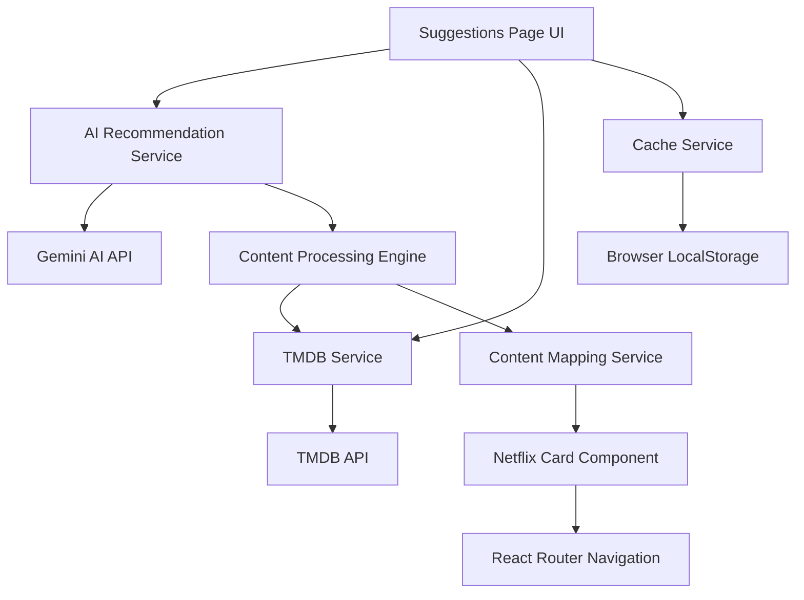
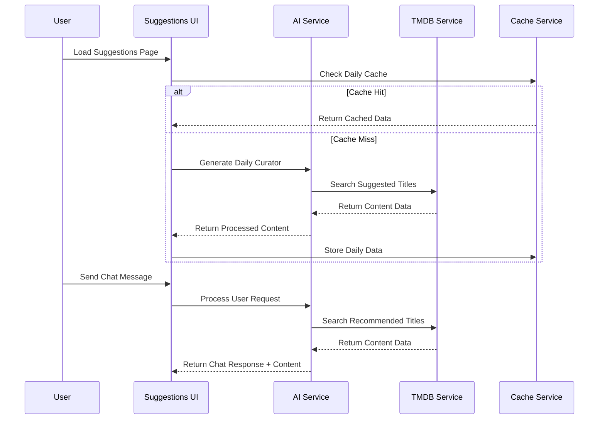

# Design Document

## Overview

The AI Suggestions Enhancement will transform the current placeholder-based suggestions page into a sophisticated, fully functional recommendation system. The design leverages the existing TMDB service infrastructure while adding intelligent AI-powered content discovery through Gemini AI integration. The system will provide both daily curated selections and interactive chat-based recommendations, all using real TMDB content data.

## Architecture

### High-Level Architecture



### Data Flow Architecture



## Components and Interfaces

### 1. AI Recommendation Service

**Purpose:** Centralized service for all AI-powered recommendation logic

**Interface:**
```typescript
interface AIRecommendationService {
  generateDailyCurator(): Promise<DailyCuratorResponse>
  processUserRequest(message: string): Promise<ChatRecommendationResponse>
  suggestContentByTheme(theme: string, count: number): Promise<string[]>
  generateCuratorPersona(): Promise<CuratorPersona>
}

interface DailyCuratorResponse {
  curator: CuratorPersona
  theme: string
  reasoning: string
  suggestedTitles: string[]
}

interface ChatRecommendationResponse {
  responseText: string
  suggestedTitles: string[]
  confidence: number
}

interface CuratorPersona {
  name: string
  bio: string
  expertise: string[]
  description: string
}
```

**Key Features:**
- Intelligent prompt engineering for consistent AI responses
- Fallback logic for AI service failures
- Content theme analysis and suggestion generation
- Natural language processing for user chat requests

### 2. Content Processing Engine

**Purpose:** Bridge between AI suggestions and TMDB content retrieval

**Interface:**
```typescript
interface ContentProcessingEngine {
  convertAISuggestionsToTMDB(titles: string[]): Promise<ContentItem[]>
  searchAndValidateContent(title: string, type?: 'movie' | 'tv'): Promise<ContentItem | null>
  batchProcessTitles(titles: string[]): Promise<ContentItem[]>
  enrichContentWithMetadata(content: ContentItem[]): Promise<ContentItem[]>
}
```

**Key Features:**
- Concurrent TMDB API requests for performance
- Intelligent content type detection (movie vs TV)
- Fallback search strategies for partial matches
- Content validation and quality filtering

### 3. Enhanced Cache Service

**Purpose:** Intelligent caching for AI responses and TMDB data

**Interface:**
```typescript
interface EnhancedCacheService {
  getDailySelection(date: string): DailySelection | null
  storeDailySelection(date: string, selection: DailySelection): void
  getChatResponse(messageHash: string): ChatMessage | null
  storeChatResponse(messageHash: string, response: ChatMessage): void
  getTMDBContent(tmdbId: number): ContentItem | null
  storeTMDBContent(content: ContentItem): void
  cleanupExpiredCache(): void
}
```

**Key Features:**
- Time-based cache expiration (24h for daily, 1h for chat)
- Automatic cleanup of expired entries
- Content deduplication and optimization
- Cross-session persistence

### 4. Smart Content Mapper

**Purpose:** Convert TMDB data to application-specific formats

**Interface:**
```typescript
interface SmartContentMapper {
  tmdbToNetflixCard(tmdbContent: ContentItem): NetflixCardContent
  tmdbToStreamingUrl(tmdbContent: ContentItem): string
  validateContentCompleteness(content: ContentItem): boolean
  enrichWithStreamingData(content: ContentItem): ContentItem
}
```

**Key Features:**
- Consistent data transformation across the application
- Proper IMDB ID handling for streaming URLs
- Content validation and completeness checking
- Streaming URL generation with fallbacks

## Data Models

### Enhanced Daily Selection Model

```typescript
interface EnhancedDailySelection {
  date: string
  curator: {
    name: string
    bio: string
    expertise: string[]
    description: string
    avatar?: string
  }
  theme: {
    name: string
    description: string
    reasoning: string
    tags: string[]
  }
  content: ContentItem[]
  metadata: {
    generatedAt: string
    aiModel: string
    contentSource: 'tmdb'
    quality: 'high' | 'medium' | 'low'
  }
}
```

### Enhanced Chat Message Model

```typescript
interface EnhancedChatMessage {
  id: string
  type: 'user' | 'ai'
  content: string
  suggestions?: ContentItem[]
  metadata?: {
    processingTime: number
    aiConfidence: number
    tmdbMatches: number
    fallbackUsed: boolean
  }
  timestamp: Date
  isLoading?: boolean
}
```

### Content Recommendation Context

```typescript
interface RecommendationContext {
  userPreferences: {
    genres: string[]
    excludedGenres: string[]
    preferredDecades: number[]
    contentTypes: ('movie' | 'tv')[]
    minRating: number
    maxRuntime?: number
  }
  sessionHistory: string[]
  previousRecommendations: string[]
  currentMood?: string
  specificRequests?: string[]
}
```

## Error Handling

### Error Hierarchy

```typescript
class SuggestionsError extends Error {
  constructor(message: string, public code: string, public recoverable: boolean) {
    super(message)
  }
}

class AIServiceError extends SuggestionsError {
  constructor(message: string, public aiProvider: string) {
    super(message, 'AI_SERVICE_ERROR', true)
  }
}

class TMDBServiceError extends SuggestionsError {
  constructor(message: string, public endpoint: string) {
    super(message, 'TMDB_SERVICE_ERROR', true)
  }
}

class ContentProcessingError extends SuggestionsError {
  constructor(message: string, public contentTitle: string) {
    super(message, 'CONTENT_PROCESSING_ERROR', false)
  }
}
```

### Error Recovery Strategies

1. **AI Service Failures:**
   - Fallback to predefined curator profiles
   - Use cached responses from previous successful requests
   - Implement retry logic with exponential backoff

2. **TMDB API Failures:**
   - Use cached content data when available
   - Implement graceful degradation with placeholder content
   - Batch failed requests for later retry

3. **Content Processing Failures:**
   - Skip failed individual items and continue processing
   - Log failures for monitoring and improvement
   - Provide user feedback for completely failed requests

## Testing Strategy

### Unit Testing

**AI Recommendation Service Tests:**
- Mock Gemini AI responses for consistent testing
- Test fallback logic when AI services fail
- Validate prompt engineering and response parsing
- Test content theme analysis and suggestion generation

**Content Processing Engine Tests:**
- Mock TMDB API responses for various content types
- Test concurrent processing and error handling
- Validate content type detection and mapping
- Test batch processing performance and reliability

**Cache Service Tests:**
- Test cache expiration and cleanup logic
- Validate data persistence across sessions
- Test cache invalidation strategies
- Performance testing for large cache sizes

### Integration Testing

**End-to-End User Flows:**
- Daily curator generation and content display
- Chat interaction with AI and content recommendations
- Content card interaction and navigation
- Error scenarios and recovery paths

**API Integration Tests:**
- TMDB API integration with various search queries
- Gemini AI integration with different prompt types
- Rate limiting and error handling
- Content data consistency across services

### Performance Testing

**Load Testing Scenarios:**
- Concurrent daily curator generation
- Multiple simultaneous chat interactions
- TMDB API rate limiting behavior
- Cache performance under load

**Optimization Targets:**
- Daily curator generation: < 3 seconds
- Chat response time: < 2 seconds
- Content card rendering: < 500ms
- Page load time: < 1 second (cached content)

## Security Considerations

### API Key Management
- Secure storage of Gemini AI and TMDB API keys
- Environment-based configuration
- Rate limiting and usage monitoring
- Error message sanitization to prevent key exposure

### Content Validation
- Input sanitization for user chat messages
- Content filtering for inappropriate suggestions
- TMDB content validation and safety checks
- XSS prevention in AI-generated content display

### Privacy Protection
- No storage of personally identifiable user preferences
- Session-based recommendation context only
- Secure handling of user interaction data
- Compliance with content recommendation privacy standards

## Deployment and Monitoring

### Performance Monitoring
- AI service response times and success rates
- TMDB API usage and rate limiting metrics
- Content processing success rates
- User interaction and engagement metrics

### Error Monitoring
- AI service failure rates and error types
- TMDB API error patterns and recovery success
- Content processing failure analysis
- User-reported issues and feedback

### Optimization Opportunities
- AI prompt optimization based on success rates
- TMDB search query optimization
- Cache hit rate improvement strategies
- Content recommendation quality metrics